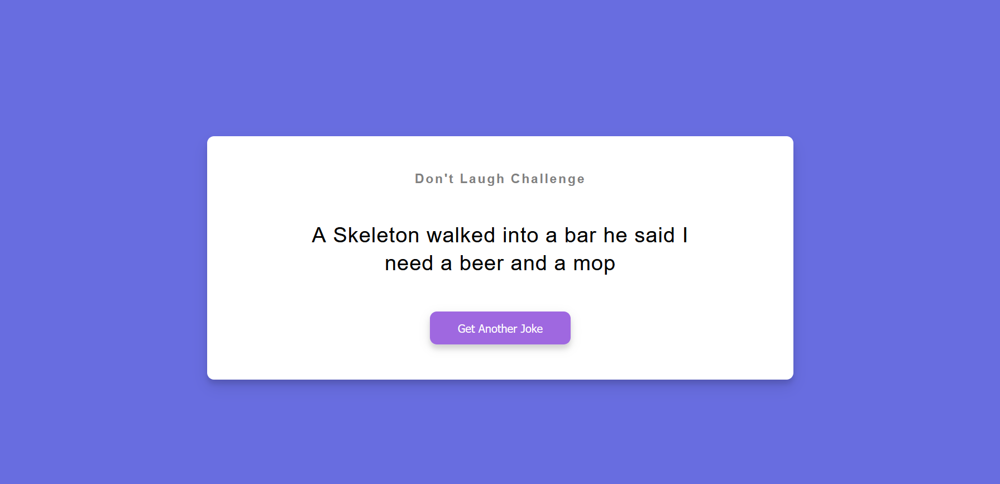

#     API-N1-Dad-Jokes

<br>
<div align="center">





</div>
<br>

## 👋 Introduction

Welcome to the API-N1-Dad-Jokes repository! This project is a simple web application that fetches dad jokes from the "icanhazdadjoke" API and displays them on the webpage. Challenge yourself with the "Don't Laugh Challenge" by clicking the "Get Another Joke" button.


## 👩‍💻 Getting Started

1. **Clone the repository:**
    ```bash
    git clone https://github.com/dialomt/API-N1-Dad-Jokes-.git
    ```

2. **Open the `index.html` file in your web browser.**

3. **Click the "Get Another Joke" button and enjoy the dad jokes!**

## 📚 Usage

Feel free to use this project as a template for creating your own dad joke web application or as a starting point for learning web development.

- The project uses the [icanhazdadjoke](https://icanhazdadjoke.com/) API to fetch dad jokes.


## 🖌️ Color Reference

| Color             | Hex                                                                |
| ----------------- | ------------------------------------------------------------------ |
| Blue Steel |  #686de0 |
| Lilac |  #9f68e0 |
|                   | 

## 🛠️ Skills

[](https://skillicons.dev)

Have fun and happy coding! 😄
